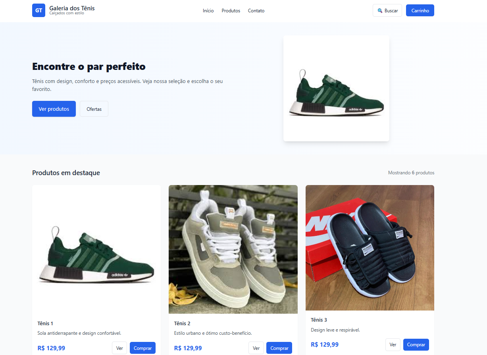

# 👟 Galeria dos Tênis — Loja Virtual

Um projeto de e-commerce moderno, limpo e totalmente responsivo desenvolvido para a simulação de uma loja online de calçados de estilo. A aplicação conta com uma vitrine dinâmica de produtos em destaque e interações em tempo real para melhorar a experiência do usuário.

---

## 🚀 Funcionalidades Principais

* **🛒 Carrinho de Compras Interativo:** Sistema dinâmico em JavaScript para gerenciamento e adição de produtos ao carrinho.
* **🔍 Sistema de Busca:** Campo integrado na interface para simulação ou filtragem rápida de calçados.
* **📱 Design Responsivo e Fluido:** Interface totalmente adaptável para dispositivos móveis, tablets e desktops.
* **💎 Vitrine de Destaques:** Layout moderno em grid organizando preços, imagens e detalhes dos produtos de forma limpa.

---

## 🛠️ Tecnologias Utilizadas

Este projeto foi construído utilizando as tecnologias fundamentais da Web (Vanilla Stack):

* **HTML5:** Estruturação semântica e acessível de todas as seções da página.
* **CSS3:** Estilização moderna, uso de Flexbox/Grid Layout para alinhamento e design visual limpo.
* **JavaScript (ES6):** Manipulação do DOM para controle do carrinho, eventos de clique nos botões "Comprar" e interatividade.

---

## 📦 Como Executar o Projeto Localmente

Por ser um projeto puramente Front-end, você não precisa de nenhum servidor local (como XAMPP) para rodá-lo!

### Passos:

1. Na página inicial deste repositório, clique no botão verde **"Code"** e selecione **"Download ZIP"**.
2. Extraia a pasta compactada em qualquer diretório do seu computador.
3. Abra a pasta extraída e dê um **duplo clique no arquivo `index.html`**. 
4. O projeto abrirá instantaneamente no seu navegador padrão!

---

## 🎨 Demonstração Visual

| Interface Principal da Loja |
| :---: |
|  |

---

# 👨‍💻 Autor

Matheus Araujo da Silva

- Site/Portifólio: https://matheus-araujo.net.br
- GitHub: https://github.com/matheusaraujo019
- LinkedIn: https://www.linkedin.com/in/matheus-araujo-da-silva-9a082b388/

---

# 📄 Licença

Este projeto está sob a licença MIT.

